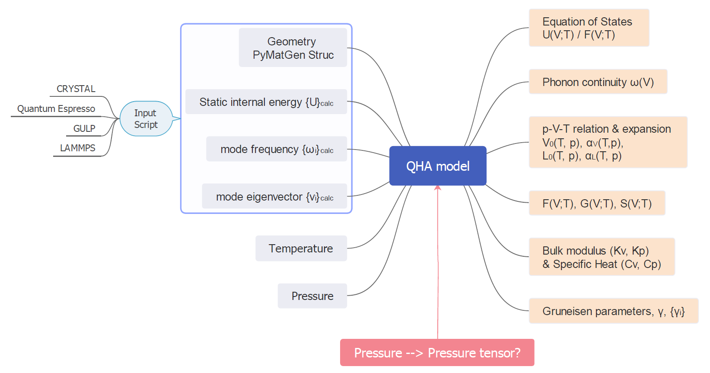
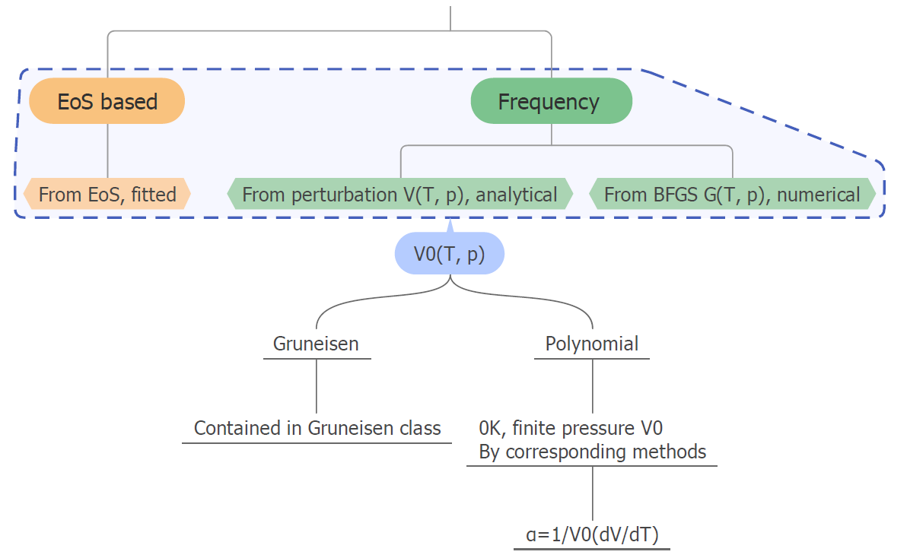

# Crystal Shape Control project - QHA-model package

This folder contains the ongoing work for developing the simulation package based on exact phonon frequencies. Its temporary name (I haven't got a good name for that), QHA-mode, originates from adopting quasi-harmonic approximation (QHA) for harmonic phonon calculation outputs by [CRYSTAL17](https://www.crystal.unito.it/index.php) and used to be part of [crystal_tools package](https://github.com/crystal-code-tools/crystal_functions). The work of making it independent from crystal_tools is ongoing since now its application scenario has been significantly broadened. For the latest updates please refer to [Spica.Vir.'s fork repository](https://github.com/Spica-Vir/crystal_shape_control/tree/main/QHA-model).

Currently there is no release of this package.

## General Structure
The current development is focused on post-processing of phonon frequencies, so it relies on external solvers to make finite displacements, construct dynamic matrices and print frequencies and eigenvectors of vibration modes. The construction of dynamical matrices and computation of anisotropic pressure is listed as the long-term plan. The following figure shows the utilities of this package. 



So far outputs of the following code is supported:

* [CRYSTAL17](https://www.crystal.unito.it/index.php)

## Establishing p-V-T relationship
The pressure-volume-temperature (p-V-T) relationship is the foundation of various important thermodynamic properties including entropy, free energy and heat capacity. There are 3 options to establish the p-V-T relationship, as illustrated in the following figure:


1. Purely analytical and EoS based - Inspired by the [qha module of phonopy](https://phonopy.github.io/phonopy/qha.html), minimum computational load.  
2. Derivation based 2 step fittings - Inspired by the QHA module of [CRYSTAL17](https://www.crystal.unito.it/index.php) medium computational load.  
3. Purely numerical minimization - maximum computational load.

## Thermal expansion & coefficients
Equilibrium volume and thermal expansion at finite temperature and pressure are important criteria to examine the reliability of QHA fitting. The following figure shows schemes adopted for thermal expansion and coefficients. 



Note that the volumetric thermal expansion coefficient $\alpha_{V}(T)$ is computed against the 0K equilibrium volume. Therefore, $V-V_{0}=T\alpha_{V}(T)$.

## Developing notes & Reminders
### Unit system & constants
During developing, 2 catagories of units should be distinguished:
1. External units: For data I/O
2. Solver units: For all calculations. The Hartree unit system is adopted. 

Constants and unit conversion coefficients are defined in 'constants.py'. When reading files, use the following line to convert the original data (eV in this case) to solver unit system (Hartree):

``` python
>>> import constants as cst
>>> energy /= cst.ev
```

Similarily, use the following line to express data in solver unit system (Hartree) by external unit system (kJ/mol):

``` python
>>> import constants as cst
>>> energy *= cst.kjmol
```

### I/O
Formats of important quantutities:

| VARIABLE    | DATA TYPE              | DEFINITION |
|:-----------:|:----------------------:|:-----------|
| dimension   | int                    | Dimension of the system |
| structure   | PyMatGen Structure     | Geometry of the system |
| supercell   | 3\*3 numpy array       | Supercell expansion matrix |
| eint        | float                  | Internal energy without vibration |
| qpoint      | nqpoint\*4 numpy array | `[x, y, z, w]`, Fractional coordinates and weights of phonon q points in reciprocal space |
| frequency   | nqpoint\*nmode array   | Frequency of phonon modes |
| symmetry    | nqpoint\*nmode array (?)                      | Symmetry of phonon modes |
| eigenvector | nqpoint\*nmode\*natom\*3 complex number array | Eigenvectors of phonon modes. Normalized to 1 |

To allow for reading multiple inputs, a wrapper function should be written to call the output reader classes.